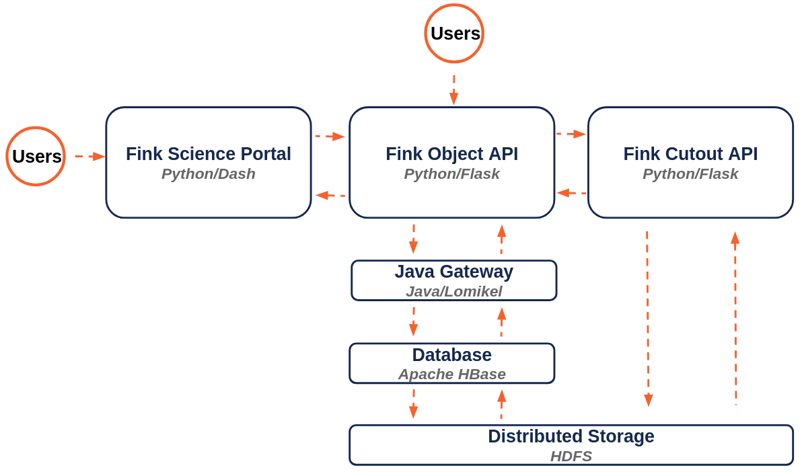

# Fink object API

[](https://github.com/astrolabsoftware/fink-object-api/actions?query=workflow%3ASentinel)



The object API is a Flask application used to access object data stored in tables in Apache HBase. The application relies internally on two components, the Java Gateway and the Fink cutout API. 

The Java Gateway enables the Flask application to communicate with a JVM using [py4j](https://www.py4j.org/), where the Fink HBase client based on [Lomikel](https://github.com/hrivnac/Lomikel) is available. This client simplifies the interaction with HBase tables, where Fink aggregated alert data is stored.

The Fink cutout API is a Flask application to access cutouts from the Fink datalake. We only store cutout metadata in HBase, and this API retrieves the data from the raw parquet files stored on HDFS.

_From 2019 to 2024, the development of this API was done in [fink-science-portal](https://github.com/astrolabsoftware/fink-science-portal). Check this repository for older issues and PR._

## Documentation

There are several forms of documentation, depending on what you are looking for: 

- Tutorials/How-to guides: [Fink user manual](https://fink-broker.readthedocs.io/en/latest/services/search/getting_started/#quick-start-api)
- API Reference guide: [https://api.fink-portal.org](https://api.fink-portal.org)
- Notes for developpers and maintainers (auth required): [GitLab](https://gitlab.in2p3.fr/fink/rubin-performance-check/-/blob/main/portal/README.md?ref_type=heads)

## Requirements and installation

You will need Python installed (>=3.9) with requirements listed in [requirements.txt](requirements.txt). You will also need [fink-cutout-api](https://github.com/astrolabsoftware/fink-cutout-api) fully installed (which implies Hadoop installed on the machine, and Java 11/17). For the full installation and deployment, refer as to the [procedure](install/README.md).

## Deployment

The input parameters can be found in [config.yml](config.yml). Make sure that the `SCHEMAVER` is the same you use for your tables in HBase.

### Debug

After starting the Fink Java Gateway and [fink-cutout-api](https://github.com/astrolabsoftware/fink-cutout-api) services, you can simply launch the API in debug mode using:

```bash
python app.py
```

### Production

The application is simply managed by `gunicorn` and `systemd` (see [install](install/README.md)), and you can manage it using:

```bash
# start the application
systemctl start fink_object_api

# reload the application if code changed
systemctl restart fink_object_api

# stop the application
systemctl stop fink_object_api
```

## Tests

All the routes are extensively tested. To trigger a test on a route, simply run:

```bash
python apps/routes/objects/test.py $HOST:$PORT
```

By replacing `HOST` and `$PORT` with their values (could be the main API instance). If the program exits with no error or message, the test has been successful. Alternatively, you can launch all tests using:


```bash
./run_tests.sh --url $HOST:$PORT
```

## Profiling a route

To profile a route, simply use:

```bash
export PYTHONPATH=$PYTHONPATH:$PWD
./profile_route.sh --route apps/routes/<route>
```

Depending on the route, you will see the details of the timings and a summary similar to:

```python
Wrote profile results to profiling.py.lprof
Inspect results with:
python -m line_profiler -rmt "profiling.py.lprof"
Timer unit: 1e-06 s

Total time: 0.000241599 s
File: /home/peloton/codes/fink-object-api/apps/routes/template/utils.py
Function: my_function at line 19

Line #      Hits         Time  Per Hit   % Time  Line Contents
==============================================================
    19                                           @profile                                             
    20                                           def my_function(payload):                            
    21         1        241.6    241.6    100.0      return pd.DataFrame({payload["arg1"]: [1, 2, 3]})


  0.00 seconds - /home/peloton/codes/fink-object-api/apps/routes/template/utils.py:19 - my_function
```

### Main route performance

The main route performance for a medium size object (14 alerts, about 130 columns):

| request| time (second)|
|--------|--------------|
| Lightcurve data (3 cols) | 0.1 |
| Lightcurve data (130 cols) | 0.3 |
| Lightcurve & 1 cutout data | 3.4 |
| Lightcurve & 3 cutout data | 5.4 |

Requesting cutouts is costly! We have 14 alerts, which is about 0.25 second per cutout. Note that requesting 3 cutouts is faster then 3 times 1 cutout, as what drives the cost is to load the full block in HDFS in memory (see this [discussion](https://github.com/astrolabsoftware/fink-broker/issues/921) about the strategy behind). 

Note that for lightcurve data, the time is fortunately not linear with the number of alerts per object:

| request| time (second)|
|--------|--------------|
| Lightcurve data (33 alerts, 130 cols) | 0.3 |
| Lightcurve data (1575 alerts, 130 cols) | 1.8|


### The power of the Gateway

Initially, we loaded the client JAR using jpype at the application's start, sharing the client among all users. This approach caused several issues due to the client's lack of thread safety. To resolve this, we switched to an isolation mode, where a new client is created for each query instead of reusing a global client (see astrolabsoftware/fink-science-portal#516).

While this strategy effectively prevents conflicts between sessions, it significantly slows down individual queries. For instance, when using the route `api/v1/objects`, the overall query time is primarily determined by the time taken to load the client.

Instead of loading the client from scratch in the Python application for each query, we now spawn a JVM once (from outside the Python application), and access Java objects dynamically from the Python application using py4j. This has led to huge speed-up for most queries without the need for cutouts, e.g. for the `/api/v1/objects` route:

| | time (second)|
|--------|--------------|
| Isolation mode | 3.4 |
| Gateway | 0.3 | 

## Adding a new route

You find a [template](apps/routes/template) route to start a new route. Just copy this folder, and modify it with your new route. Alternatively, you can see how other routes are structured to get inspiration. Do not forget to add tests in the [test folder](tests/)!

## Todo

- [ ] configuration: Find a way to automatically sync schema with tables.
- [ ] Add nginx management
- [ ] Add bash scripts under `bin/` to manage both nginx and gunicorn
- [ ] Make tests more verbose, even is successful.

